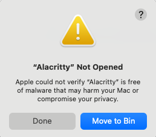

# Dotfiles using git bare repo
https://www.atlassian.com/git/tutorials/dotfiles

## Alacritty
If Alacritty fails to open with somethign similar

Try: 
1. Settings->Security and Privacy
2. Scroll down to Security section at the bottom
3. If you tried to open Alacritty, there should be an option to "Open Anyway" from one of the options in this section.
